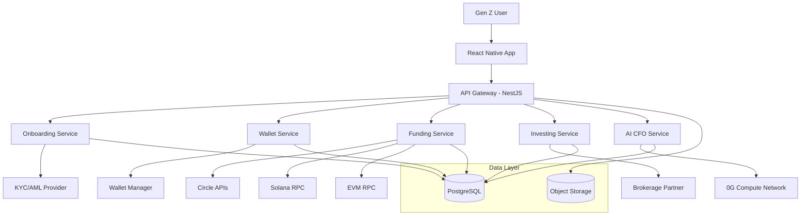

# STACK - Web3-Native Investment Platform 🚀

<div align="center">
  
  <h3>🌟 The Future of Gen Z Investment</h3>
  <p><strong>A hybrid Web3 + Traditional Finance platform designed for digital natives</strong></p>
  <p>
    <a href="#quick-start">Quick Start</a> •
    <a href="#architecture">Architecture</a> •
    <a href="#features">Features</a> •
    <a href="#api-documentation">API</a> •
    <a href="#contributing">Contributing</a>
  </p>
</div>

---

## 📋 Table of Contents

- [🎯 Overview](#-overview)
- [✨ Key Features](#-key-features)
- [🏗️ Architecture](#️-architecture)
- [🚀 Quick Start](#-quick-start)
- [📁 Project Structure](#-project-structure)
- [💻 Development](#-development)
- [🤖 AI CFO](#-ai-cfo)
- [📱 Mobile App](#-mobile-app)
- [🔗 API Documentation](#-api-documentation)
- [🐳 Deployment](#-deployment)
- [📜 Available Scripts](#-available-scripts)
- [🧪 Testing](#-testing)
- [🤝 Contributing](#-contributing)
- [📄 License](#-license)

## 🎯 Overview

**STACK** is a revolutionary Web3-native investment app designed specifically for Gen Z users who are underserved by traditional banks and overwhelmed by complex crypto tools. It bridges the gap between traditional finance and Web3, enabling instant wealth-building through a seamless hybrid model.

### 🎪 Target Audience

**Taylor - The Conscious & Connected Investor (Primary Persona)**
- **Age:** 22, digitally native, balances work with side hustles
- **Digital Habits:** Lives on TikTok, Instagram, Reddit, Discord
- **Financial Behavior:** Uses Cash App/Venmo, cautious about crypto complexity
- **Values:** Financial independence, sustainability, social impact

### 🌟 Mission

Create a safe, frictionless investment platform that demystifies Web3 while outperforming legacy banking in speed and fairness, delivering an experience that matches Gen Z expectations: fast, social, intuitive, and values-aligned.

### 🎯 Business Goals
- **10,000 MAU** within 6 months of launch
- **5% conversion** from free to premium users in Year 1
- **$1,000,000** in processed investments in Year 1
- Position as **first mover** in Gen Z-native hybrid Web3 + TradFi space

## ✨ Key Features

### 🎯 MVP Core Features

| Feature | Description | Status |
|---------|-------------|--------|
| **🔐 Managed Wallets** | Secure, custody-abstracted wallet creation (no seed phrases) | ✅ |
| **💰 Stablecoin Deposits** | Multi-chain support (Ethereum, Solana) with auto-conversion | ✅ |
| **📈 Curated Baskets** | 5-10 expert-curated investment options (Tech, ESG, ETFs) | ✅ |
| **🤖 AI CFO** | Weekly summaries & portfolio analysis powered by 0G Network | ✅ |
| **🏦 Brokerage Integration** | Seamless stock/ETF trading with secure custody | ✅ |
| **📱 Mobile-First UX** | TikTok-meets-Cash App experience for Gen Z | ✅ |

### 🔮 Post-MVP Roadmap

- **Phase 2**: Full conversational AI CFO, social features, user-curated baskets
- **1-2 Years**: Debit card, P2P payments, business accounts, startup launchpad

## 🏗️ Architecture

### 🎨 System Overview (C4 Model)



### 🏛️ Technology Stack

| Layer | Technology | Purpose |
|-------|------------|----------|
| **📱 Mobile** | React Native + Expo | Cross-platform native experience |
| **🔧 Backend** | Node.js + NestJS | Scalable, modular API architecture |
| **💾 Database** | PostgreSQL + Prisma | Type-safe database operations |
| **🤖 AI** | 0G Compute Network | Decentralized AI inference (TEE) |
| **💰 Crypto** | Circle, Turnkey | Wallet infrastructure & stablecoins |
| **📈 Trading** | Partner Brokerage | Stock/ETF execution & custody |
| **☁️ Cloud** | AWS (ECS/RDS/S3) | Scalable cloud infrastructure |

### 📊 Monorepo Structure

```
STACK/
├── 📱 apps/
│   ├── mobile/                 # Expo React Native app
│   │   ├── app/               # App Router structure
│   │   ├── components/        # UI components
│   │   ├── assets/           # Images, fonts, icons
│   │   └── package.json
│   └── api/                   # NestJS API service
│       ├── src/
│       │   ├── routes/       # API endpoints
│       │   ├── services/     # Business logic
│       │   ├── middleware/   # Auth, error handling
│       │   └── config/      # Configuration
│       └── package.json
├── 📦 packages/
│   ├── database/             # Prisma schema & migrations
│   ├── shared-types/         # TypeScript interfaces
│   ├── ui/                   # Shared UI components
│   └── config/              # ESLint, TypeScript configs
├── 📋 docs/
│   ├── architecture.md      # Technical architecture
│   ├── prd.md              # Product requirements
│   ├── epics.md            # Development epics
│   └── open_api.yaml       # API specification
├── 🔧 .bmad-core/           # BMad development framework
└── 🐳 Infrastructure files (Docker, CI/CD)
```

## 🚀 Quick Start

### ⚡ Prerequisites

- **Node.js** >= 18.0.0
- **pnpm** >= 8.0.0 (Package manager)
- **Docker** & **Docker Compose**
- **Expo CLI** (for mobile development)
- **0G Network Account** (for AI CFO features)

### 🎯 1-Minute Setup

```bash
# Clone the repository
git clone https://github.com/your-username/stack.git
cd stack

# Install dependencies
pnpm install

# Set up environment variables
cp apps/api/.env.example apps/api/.env
# Edit apps/api/.env with your configuration

# Start infrastructure services
docker-compose up -d postgres redis

# Set up database
pnpm --filter @stack/database db:generate
pnpm --filter @stack/database db:push

# Build all packages
pnpm build

# Start development servers
pnpm dev
```

### 🎮 What's Running?

After `pnpm dev`, you'll have:
- **📱 Mobile App**: Expo dev server on http://localhost:8081
- **🔧 API Server**: NestJS API on http://localhost:3001
- **📊 Database**: PostgreSQL on localhost:5432
- **🔄 Redis**: Cache/sessions on localhost:6379

### 📱 Mobile Development

```bash
# Start mobile app
cd apps/mobile
echo "Download Expo Go app on your phone"
echo "Scan QR code to run on device"

# Or run on simulators
pnpm ios      # iOS Simulator
pnpm android  # Android Emulator
```

## 💻 Development

### 🔄 Development Workflow

```bash
# Start all services in development mode
pnpm dev

# Start individual services
pnpm --filter @stack/api dev        # API only
pnpm --filter @stack/mobile dev     # Mobile only

# Database operations
pnpm --filter @stack/database db:generate  # Generate Prisma client
pnpm --filter @stack/database db:push     # Push schema changes
pnpm --filter @stack/database db:studio   # Open Prisma Studio

# Code quality
pnpm lint         # Lint all packages
pnpm format       # Format all code
pnpm test         # Run all tests
```

### 🗂️ Key Directories

| Path | Purpose |
|------|----------|
| `apps/mobile/app/(auth)/` | Authentication screens (signin, signup, verify) |
| `apps/mobile/app/(tabs)/` | Main app tabs (home, card, portfolio, profile) |
| `apps/mobile/components/ui/` | Reusable UI components (Button, Input, OTP) |
| `apps/api/src/routes/` | API route handlers |
| `apps/api/src/services/` | Business logic services |
| `packages/database/` | Prisma schema and migrations |
| `packages/shared-types/` | TypeScript type definitions |
| `docs/` | Technical documentation |

## 🤖 AI CFO

### 🧠 Powered by 0G Compute Network

The AI CFO is the crown jewel of STACK, providing personalized financial insights using decentralized AI running in Trusted Execution Environments (TEE).

**🎯 Key Features:**
- **Weekly Performance Summaries** - Automated reports every Monday
- **Real-time Portfolio Analysis** - On-demand insights and recommendations  
- **Personalized Nudges** - Daily financial guidance and alerts
- **Risk Assessment** - Comprehensive portfolio risk analysis

### 🔧 AI Models

| Model | Purpose | Provider |
|-------|---------|----------|
| **gpt-oss-120b** | Primary insights & analysis | 0xf07240Efa67755B5311bc75784a061eDB47165Dd |
| **deepseek-r1-70b** | Complex reasoning & fallback | 0x3feE5a4dd5FDb8a32dDA97Bed899830605dBD9D3 |

### 🛡️ Security & Privacy
- **🔐 End-to-end encryption** of all financial data
- **🏛️ TEE execution** ensures verifiable AI computations  
- **🔑 User-specific keys** for data isolation
- **📋 Audit trails** for all AI interactions

### 📊 API Endpoints

```http
# Generate financial insight
POST /api/v1/ai-cfo/insight
{
  "prompt": "Analyze my portfolio for rebalancing",
  "context": { "portfolio": {...} }
}

# Get weekly summary
GET /api/v1/ai-cfo/weekly-summary

# Health check
GET /api/v1/ai-cfo/health

# Usage metrics
GET /api/v1/ai-cfo/metrics
```

## 📱 Mobile App

### 🎨 Design Philosophy

**"TikTok meets Cash App for investing"** - Fast, intuitive, visually appealing interface designed for Gen Z digital natives.

### 📋 App Structure

```
app/
├── (auth)/                    # Authentication flow
│   ├── signin.tsx            # Login screen
│   ├── signup.tsx            # Registration
│   └── verify-email.tsx      # Email verification
├── (tabs)/                   # Main application
│   ├── home/                 # Dashboard & insights
│   ├── card/                 # Digital card features
│   ├── portfolio/            # Investment portfolio
│   └── profile/              # User settings
├── _layout.tsx               # Root layout
└── index.tsx                 # App entry point
```

### 🎭 Custom Components

| Component | Purpose |
|-----------|----------|
| `<Button />` | Primary action buttons with variants |
| `<Input />` | Form inputs with validation |
| `<OTPInput />` | One-time password entry |
| `<SplashScreen />` | App loading screen |

### 🎨 Design System

- **🎨 Colors**: Custom color palette optimized for Gen Z
- **✍️ Typography**: Outward font family (Block, Borders, Round)
- **🌟 Icons**: Custom icon set with brand consistency
- **📱 Layout**: Mobile-first responsive design

## 🔗 API Documentation

### 🛡️ Authentication

All API endpoints use JWT Bearer token authentication:

```http
Authorization: Bearer <your-jwt-token>
```

### 🔑 Core Endpoints

#### 💰 Funding

```http
# Generate deposit address
POST /funding/deposit/address
{
  "chain": "ethereum" | "solana"
}

# Get balances
GET /balances

# List confirmations
GET /funding/confirmations?limit=20&cursor=...
```

#### 📈 Investing

```http
# List curated baskets
GET /baskets

# Get basket details
GET /baskets/{id}

# Place order
POST /orders
{
  "basketId": "uuid",
  "amount": "1000.00",
  "side": "buy"
}

# Get portfolio
GET /portfolio
```

#### 👤 User Management

```http
# Start onboarding
POST /onboarding/start

# Get KYC status
GET /onboarding/status

# Wallet addresses
GET /wallet/addresses?chain=eth
```

### 📄 Full API Specification

See [`docs/open_api.yaml`](./docs/open_api.yaml) for complete OpenAPI 3.1 specification.

## 🐳 Deployment

### 🚀 Production Deployment

```bash
# Build production images
docker-compose -f docker-compose.prod.yml build

# Deploy with scaling
docker-compose -f docker-compose.prod.yml up -d --scale api=3

# Health check
curl https://api.stack.app/health
```

### ☁️ Infrastructure

| Service | Technology | Purpose |
|---------|------------|----------|
| **Compute** | AWS ECS/Fargate | Scalable container orchestration |
| **Database** | RDS PostgreSQL | Multi-AZ production database |
| **Cache** | ElastiCache Redis | Sessions and performance |
| **Storage** | S3 + CloudFront | Static assets and CDN |
| **Security** | WAF + API Gateway | DDoS protection and routing |

### 📊 Monitoring

- **📈 Metrics**: CloudWatch + custom dashboards
- **🚨 Alerts**: Automated alerting for critical metrics
- **📝 Logging**: Structured JSON logs with correlation IDs
- **🔍 Tracing**: OpenTelemetry for request tracing


## 📜 Available Scripts

### 🎯 Root Level Scripts

| Script | Description |
|--------|-------------|
| `pnpm dev` | Start all services in development mode |
| `pnpm build` | Build all packages for production |
| `pnpm lint` | Lint all TypeScript/JavaScript code |
| `pnpm format` | Format code using Prettier |
| `pnpm test` | Run all test suites |
| `pnpm clean` | Clean all build outputs |
| `pnpm setup` | Full project setup (install + build) |

### 🐳 Docker Scripts

| Script | Description |
|--------|-------------|
| `pnpm docker:build` | Build all Docker images |
| `pnpm docker:up` | Start development containers |
| `pnpm docker:down` | Stop all containers |

### 📱 Mobile Scripts (in apps/mobile/)

| Script | Description |
|--------|-------------|
| `pnpm start` | Start Expo development server |
| `pnpm ios` | Run on iOS simulator |
| `pnpm android` | Run on Android emulator |
| `pnpm prebuild` | Generate native code |

### 🔧 API Scripts (in apps/api/)

| Script | Description |
|--------|-------------|
| `pnpm dev` | Start API in development mode |
| `pnpm build` | Build for production |
| `pnpm start` | Start production server |
| `pnpm test` | Run API tests |

## 🧪 Testing

### 🎯 Test Strategy

- **Unit Tests**: Service logic and utility functions
- **Integration Tests**: API endpoints and database operations
- **E2E Tests**: Critical user flows on mobile

### 🧪 Running Tests

```bash
# Run all tests
pnpm test

# Run API tests only
pnpm --filter @stack/api test

# Run tests with coverage
pnpm test --coverage

# Run tests in watch mode
pnpm test --watch
```

### 🎯 Test Files

| Path | Purpose |
|------|----------|
| `apps/api/src/__tests__/` | API unit and integration tests |
| `apps/api/src/services/__tests__/` | Service layer tests |
| `packages/database/__tests__/` | Database operation tests |

## 🤝 Contributing

### 🎯 Development Principles

- **🎨 Design First**: Every feature starts with user experience
- **🔒 Security Always**: Financial data requires maximum security
- **⚡ Performance Matters**: Gen Z expects instant responses
- **📱 Mobile Native**: Mobile-first approach to all features
- **🧪 Test Coverage**: All critical paths must be tested

### 🔄 Contribution Workflow

1. **🍴 Fork & Clone**
   ```bash
   git clone https://github.com/your-userna.git
   cd stack
   ```

2. **🌟 Create Feature Branch**
   ```bash
   git checkout -b feature/amazing-new-feature
   ```

3. **💻 Develop & Test**
   ```bash
   pnpm dev          # Start development
   pnpm lint         # Check code quality
   pnpm test         # Run tests
   ```

4. **📝 Commit Changes**
   ```bash
   git commit -m 'feat: add amazing new feature'
   ```

5. **🚀 Submit PR**
   - Push to your fork
   - Open Pull Request with detailed description
   - Wait for review and CI checks

### 📋 Code Standards

- **TypeScript**: All code must be properly typed
- **ESLint**: Follow configured linting rules
- **Prettier**: Use consistent code formatting
- **Tests**: Add tests for new functionality
- **Documentation**: Update README and docs as needed

### 🐛 Reporting Issues

Found a bug? Please create an issue with:
- **📝 Clear description** of the problem
- **🔄 Steps to reproduce** the issue  
- **💻 Environment details** (OS, Node version, etc.)
- **📸 Screenshots** if applicable

## 📊 Project Status

### 🎯 Current Phase: MVP Development

| Epic | Status | Progress |
|------|--------|----------|
| 🔐 Onboarding & Wallet | ✅ Complete | 100% |
| 💰 Stablecoin Deposits | ✅ Complete | 100% |
| 📈 Investment Flow | ✅ Complete | 100% |
| 🎯 Curated Baskets | ✅ Complete | 100% |
| 🤖 AI CFO | ✅ Complete | 100% |
| 🏦 Brokerage Integration | ✅ Complete | 100% |

### 🎯 Success Metrics (Goals)

- **📈 User Acquisition**: 10,000 MAU within 6 months
- **💰 Monetization**: 5% free→premium conversion
- **📊 Validation**: $1M investment volume in Year 1
- **⭐ User Satisfaction**: >7/10 NPS score

## 🔗 Resources

### 📚 Documentation

- **[📋 Product Requirements](./docs/prd.md)** - Complete product specification
- **[🏗️ Architecture Guide](./docs/architecture.md)** - Technical architecture details  
- **[📊 Development Epics](./docs/epics.md)** - Development roadmap
- **[🔌 API Reference](./docs/open_api.yaml)** - OpenAPI specification
- **[🤖 AI CFO Guide](./apps/api/AI_CFO_README.md)** - AI features documentation

### 🌐 External Services

- **[0G Network](https://docs.0g.ai/)** - Decentralized AI compute
- **[Circle APIs](https://developers.circle.com/)** - Stablecoin infrastructure
- **[Turnkey](https://www.turnkey.com/)** - Wallet infrastructure
- **[Expo](https://docs.expo.dev/)** - Mobile development platform

### 🆘 Support

- **💬 Discord**: [Join our community](#)
- **📧 Email**: support@stack.app
- **🐛 Issues**: [GitHub Issues](https://github.com/your-username/stack/issues)
- **📖 Docs**: [Documentation Portal](#)

## 📄 License

This project is licensed under the **MIT License** - see the [LICENSE](./LICENSE) file for details.

---

<div align="center">
  <h3>🚀 Built with Cutting-Edge Technology</h3>
  <p>
    <strong>React Native</strong> • <strong>NestJS</strong> • <strong>PostgreSQL</strong> • <strong>0G Network</strong> • <strong>Circle</strong> • <strong>Turnkey</strong> • <strong>AWS</strong>
  </p>
  <p>
    <em>"The future of finance, designed for Gen Z"</em>
  </p>
  <p>
    Made with ❤️ by the STACK team
  </p>
</div>
